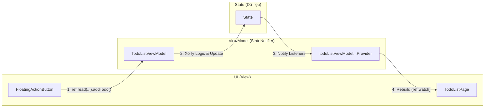

Chào bạn, **State Management** (Quản lý trạng thái) là "xương sống" của mọi ứng dụng Flutter. Nếu bạn nắm vững cái này, bạn đã làm chủ được 70% việc lập trình App.

Dựa trên source code bạn gửi (sử dụng **Riverpod** và **Clean Architecture**), tôi sẽ giải thích State Management từ khái niệm cơ bản đến cách nó đang vận hành trong chính dự án của bạn.

---

### 1. State là gì?

Trong Flutter, giao diện (UI) được xây dựng dựa trên công thức cốt lõi:

* **UI (Giao diện):** Là những gì người dùng nhìn thấy (Màn hình, Nút bấm, List danh sách).
* **State (Trạng thái):** Là **Dữ liệu** tại một thời điểm cụ thể (Ví dụ: Số lượng Todo trong danh sách, trạng thái đã tick hay chưa, theme đang là Sáng hay Tối).
* **f (Hàm build):** Là cách Flutter vẽ giao diện dựa trên dữ liệu đó.

**Ví dụ:**

* **State:** `isLoading = true` -> **UI:** Hiện vòng xoay loading.
* **State:** `isLoading = false` -> **UI:** Hiện danh sách công việc.

=> **State Management** chính là việc bạn quản lý sự thay đổi của biến `isLoading` đó và đảm bảo UI tự động cập nhật lại khi biến đó thay đổi.

---

### 2. Hai loại State chính

1. **Ephemeral State (State cục bộ):**
* Chỉ dùng trong một Widget duy nhất. Không cần chia sẻ cho ai.
* *Ví dụ:* Tab hiện tại của BottomBar, nội dung đang gõ trong TextField, hiệu ứng animation.
* *Cách dùng:* `setState()`.


2. **App State (State toàn cục):**
* Dữ liệu được chia sẻ giữa nhiều màn hình hoặc nhiều Widget khác nhau.
* *Ví dụ:* Thông tin User sau khi login, Giỏ hàng, **Danh sách Todo** (trong app của bạn).
* *Cách dùng:* Riverpod, Provider, BLoC, Redux...


---

### 3. Tại sao cần State Management (như Riverpod)?

Nếu không có State Management, để truyền dữ liệu từ màn hình A sang màn hình B, rồi xuống widget con C, bạn phải truyền qua **Constructor** liên tục (gọi là "Prop Drilling").

**Vấn đề:**

* Code rối rắm.
* Khi dữ liệu ở A thay đổi, làm sao để C biết mà vẽ lại?

**Giải pháp:** State Management tạo ra một "Kho chứa dữ liệu chung" tách biệt khỏi cây Widget.

* Widget nào cần dữ liệu? -> Kết nối thẳng vào kho.
* Widget nào muốn đổi dữ liệu? -> Gửi lệnh vào kho.

---

### 4. Phân tích State Management trong dự án của bạn (Riverpod)

Dự án của bạn đang sử dụng **Riverpod** kết hợp với **StateNotifier**. Đây là mô hình rất mạnh mẽ và an toàn.

Hãy nhìn vào sơ đồ cách State Management vận hành trong code của bạn:



#### Chi tiết từng thành phần trong code bạn:

**A. Kho chứa State (StateNotifier)**
Trong file `lib/presentation/viewmodel/todolist/todo_list_viewmodel.dart`:

* Bạn có class `TodoListViewModel` kế thừa `StateNotifier`.
* Nó giữ một cái state là `State<TodoList>` (chứa danh sách công việc).
* Nó chứa các hàm logic: `addTodo`, `completeTodo`, `deleteTodo`.

**B. Kênh phân phối (Provider)**
Cũng trong file đó, bạn khai báo:

```dart
final todoListViewModelStateNotifierProvider = StateNotifierProvider...

```

Đây là cái "ống dẫn" để đưa dữ liệu từ ViewModel ra ngoài UI.

**C. Người tiêu thụ (Consumer / UI)**
Trong file `lib/presentation/view/todo_list_page.dart`:

1. **Lắng nghe (Listening):**
```dart
ref.watch(_filteredTodoListProvider).maybeWhen(...)

```


Hàm `ref.watch` giống như việc UI đăng ký nhận báo cáo. Bất cứ khi nào `TodoList` thay đổi (thêm, xóa, sửa), Widget này sẽ tự động chạy lại (rebuild) để cập nhật giao diện mới.
2. **Ra lệnh (Action):**
```dart
ref.watch(_todoListProvider.notifier).completeTodo(todo)

```


Khi bấm nút tick, UI không tự sửa dữ liệu. Nó gọi hàm `completeTodo` trong ViewModel. ViewModel xử lý xong sẽ cập nhật State, và State lại báo ngược về UI (Vòng tròn khép kín).

---

### 5. Tại sao trong code của bạn lại có `filteredTodoListProvider`?

Đây là một điểm hay của State Management hiện đại: **Computed State (State tính toán).**

Trong file `lib/presentation/viewmodel/todolist/todo_list_viewmodel.dart`:

```dart
final filteredTodoListProvider = Provider.autoDispose<State<TodoList>>((ref) {
  final filterKind = ref.watch(filterKindViewModelStateNotifierProvider);
  final todoListState = ref.watch(todoListViewModelStateNotifierProvider);
  // ... Logic lọc ...
});

```

* Provider này **không lưu trữ** dữ liệu gốc.
* Nó lắng nghe 2 Provider khác: "Danh sách gốc" và "Loại bộ lọc" (All/Completed/Incomplete).
* Khi 1 trong 2 cái kia thay đổi, Provider này tự động tính toán lại danh sách kết quả mới.
* **Lợi ích:** UI (`TodoListPage`) không cần viết logic `if (filter == all) ...`. UI chỉ cần hiển thị những gì `filteredTodoListProvider` đưa cho. Logic lọc được tách biệt hoàn toàn.

### Tóm lại

Trong dự án này, **State Management** giúp bạn:

1. **Tách biệt:** UI (TodoListPage) chỉ lo việc vẽ, Logic (TodoListViewModel) chỉ lo xử lý dữ liệu.
2. **Đồng bộ:** Khi bạn thêm 1 Todo, danh sách tự cập nhật, bộ đếm số lượng tự tăng, bộ lọc tự chạy lại... tất cả đều tự động nhờ cơ chế `ref.watch`.
3. **Clean Code:** Dễ kiểm thử (Test) và bảo trì vì logic không bị dính chặt vào giao diện.
